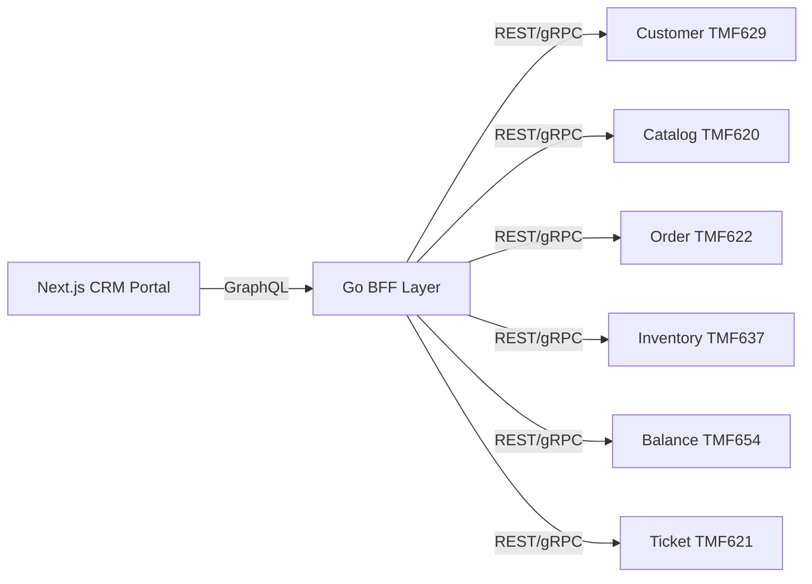
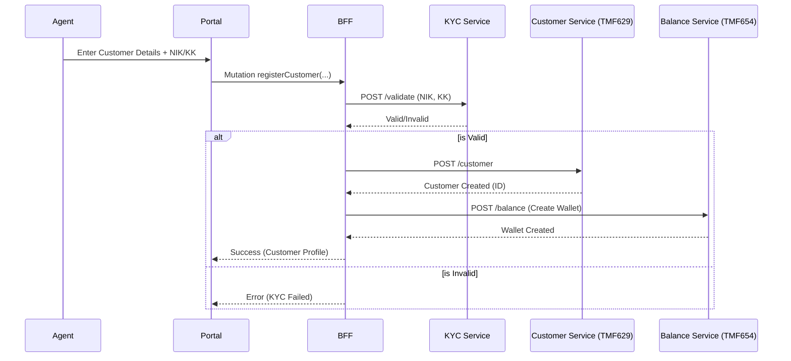
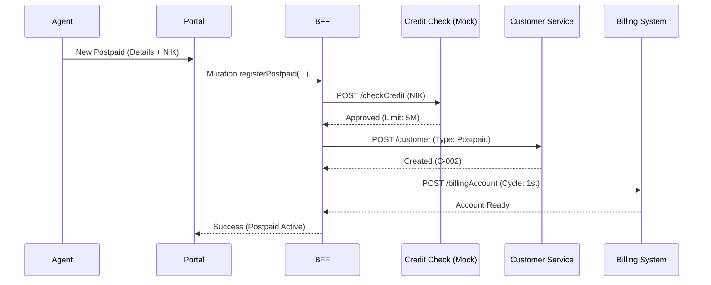
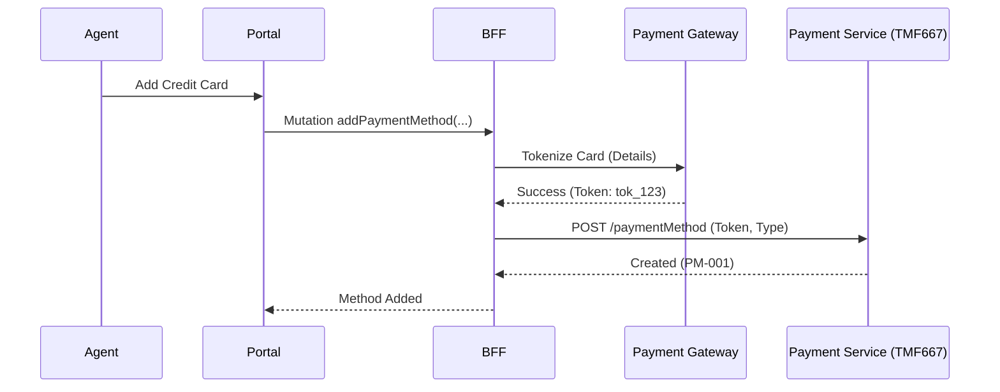
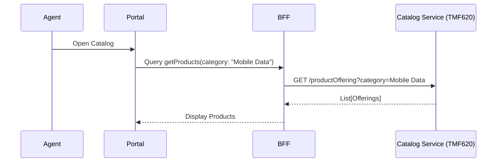
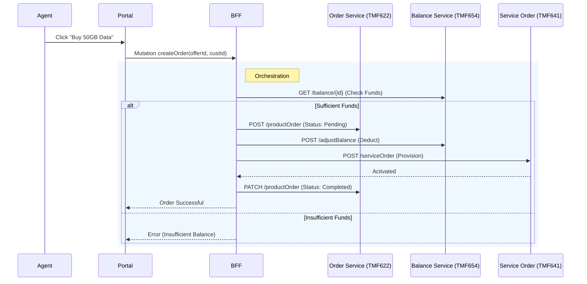
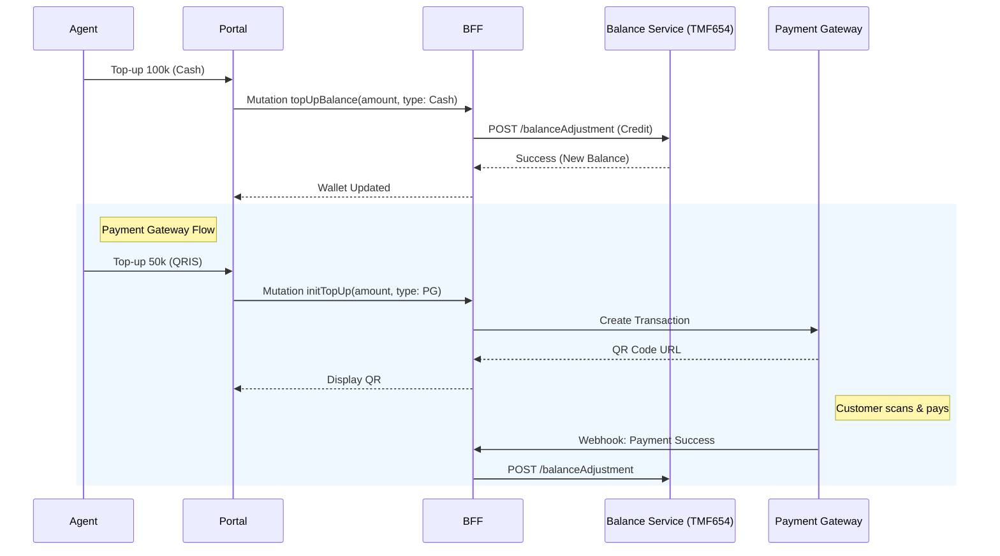
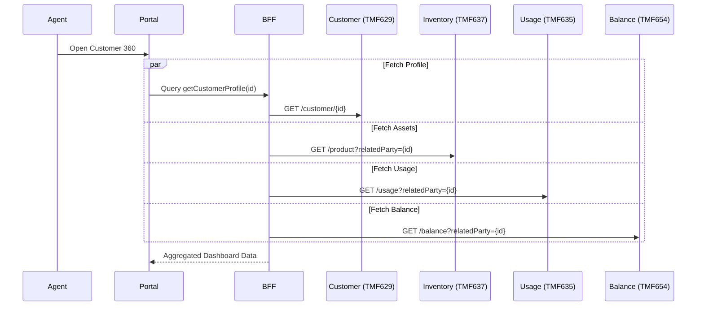
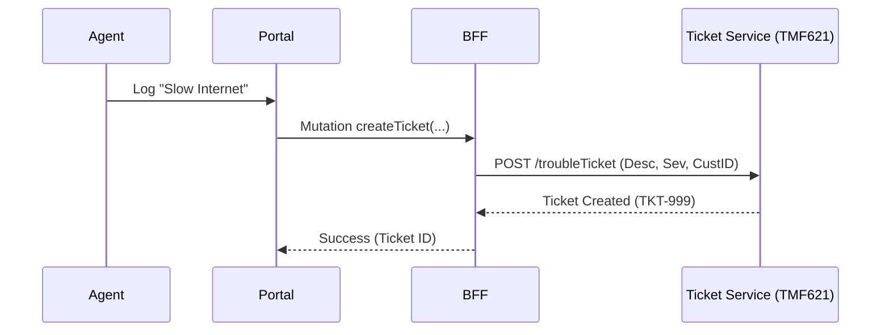
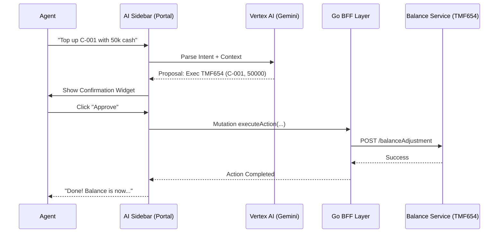

# Frontend Channels Design - CRM Portal

## 1. Overview
This document details the design for the **Web CRM Portal**, a Next.js application designed for Customer Service Agents (CSRs) and Dealer Administrators. It follows **TM Forum** standards for customer journeys, ensuring a consistent and industry-aligned experience.

## 2. Architecture: Backend for Frontend (BFF)
To ensure optimal performance and simplified frontend logic, a **GraphQL BFF** (Backend for Frontend) will be implemented.
*   **Technology**: Go (GraphQL) or Node.js (Apollo). -> *Decision: Go (gqlgen) to match backend stack.*
*   **Responsibility**: Aggregates data from multiple TMF microservices into unified schemas for the UI.

## 3. Customer Journeys & Workflows

### Journey 1: Customer Onboarding (Register & KYC)
**Goal**: Register a new subscriber and validate their identity (Indonesian KYC).
**TMF Mapping**: `TMF629` (Customer Management), `TMF632` (Party), `Regulatory/KYC`.

#### Workflow: New Individual Customer
1.  **Agent initiates "New Registration"**.
2.  **Capture Details**: Name, Email, Phone, Address.
3.  **Perform KYC**: Enter NIK (National ID) and KK (Family Card).
    *   *System Action*: Call `KYC Service` to validate against Dukcapil.
4.  **Create Customer**: If KYC passes, create Customer entity.
5.  **Provision Wallet**: Automatically provision a `Function` (Prepaid Wallet) via `TMF654`.

### Journey 1b: Postpaid Onboarding (Credit Check & Billing)
**Goal**: Register a postpaid subscriber with credit validation and billing cycle assignment.
**TMF Mapping**: `TMF629` (Customer), `TMF646` (Quote/Credit - *Future*), `TMF678` (Bill Format).

#### Workflow: Postpaid Registration
1.  **Capture Details**: Name, ID, Address (Same as Prepaid).
2.  **Credit Check**:
    *   *System Action*: Call External Credit Bureau (Mock).
    *   *Result*: Pass/Fail + Credit Limit (e.g., 5,000,000 IDR).
3.  **Select Billing Cycle**: e.g., "1st of Month" or "15th of Month".
4.  **Create Customer**: Create Entity with `Postpaid` classification.
5.  **Assign Credit Limit**: Set `CreditLimit` characteristic in `TMF654` (or Billing System).

### Journey 1c: Payment Profile Management
**Goal**: Manage multiple payment methods (Credit Card, E-Wallet, Auto-debit) for a customer *after* onboarding.
**TMF Mapping**: `TMF667` (Payment Method), `TMF678` (Payment).

#### Workflow: Add Payment Method
1.  **View Profile**: Agent navigates to "Payment Methods" tab in Customer 360.
2.  **Add Method**: Select Type (e.g., "Credit Card" or "GoPay").
3.  **Tokenize**:
    *   *System Action*: Redirect/Call Payment Gateway (Midtrans/DOKU) to tokenize card.
    *   *Result*: Receive `PaymentToken`.
4.  **Save Profile**: Store `PaymentMethod` with token.
5.  **Set Default**: (Optional) specific method as default for Auto-debit.

### Journey 2: Browse & Discover (Product Catalog)
**Goal**: View available products, filter by category, and select offers.
**TMF Mapping**: `TMF620` (Product Catalog).

#### Workflow: Catalog Browsing
1.  **Agent views "Product Catalog"**.
2.  **Filter**: Agent filters by "Mobile Data", "Voice", or "Bundles".
3.  **Select**: Agent views details of "50GB Freedom Data".
4.  **Check Eligibility**: (Optional) Verify if customer is eligible for this offer.

### Journey 3: Assign Product (Order & Purchase)
**Goal**: Purchase a product for the customer.
**TMF Mapping**: `TMF622` (Product Order), `TMF654` (Balance), `TMF641` (Service Order).

#### Workflow: Purchase with Prepaid Balance
1.  **Select Product**: Agent selects "50GB Freedom Data" for Customer `C-001`.
2.  **Verify Balance**: System checks if Customer has sufficient balance.
3.  **Capture Order**: Create `ProductOrder` with status `InProgress`.
4.  **Debit Balance**: Reserve/Deduct funds.
5.  **Fulfill**: Trigger downstream provisioning (Service Order).
6.  **Complete**: Update Order to `Completed` and Asset to `Active`.

### Journey 4: Top-up Balance (Payment)
**Goal**: Add funds to customer's wallet via external payment gateway.
**TMF Mapping**: `TMF678` (Payment - *Future*) or direct `TMF654` Adjustment.

#### Workflow: Agent Top-up
1.  **Agent selects "Top-up"**.
2.  **Enter Amount**: e.g., 100,000 IDR.
3.  **Select Method**: "Cash" (collected by agent) or "Payment Gateway".
4.  **Process**:
    *   If Cash: Agent confirms receipt -> API credits balance directly.
    *   If PG: Generate QR Code / Payment Link -> Customer pays -> Webhook credits balance.

### Journey 4b: Postpaid Bill Payment
**Goal**: Pay monthly invoice.

#### Workflow: Bill Payment
1.  **View Bill**: Agent sees "Outstanding Amount: 250,000 IDR".
2.  **Select Payment**: Cash or Gateway.
3.  **Process**:
    *   Payment clears -> `TMF678` Payment created -> Allocated to Invoice.
    *   Balance/Limit restored.

### Journey 5: Assurance (Usage & Support)
**Goal**: View usage history and troubleshoot issues.
**TMF Mapping**: `TMF635` (Usage Management), `TMF637` (Product Inventory).

#### Workflow: View 360 Dashboard
1.  **Search Customer**: Agent searches by Name or Phone.
2.  **View Profile**: See Personal Info (TMF629).
3.  **View Assets**: See "Active Products" (TMF637).
4.  **View Usage**: See "Data Consumed" vs "Quota" (TMF635).
5.  **View Balance**: See "Current Credit" (TMF654).

### Journey 6: Customer Complaints (Assurance)
**Goal**: Log, track, and resolve customer issues (Technical, Billing, Service).
**TMF Mapping**: `TMF621` (Trouble Ticket).

#### Workflow: Log Complaint
1.  **Search Customer**: Agent verifies identity.
2.  **Create Ticket**: Select type (e.g., "Slow Internet").
3.  **Add Details**: Description, Severity, and affected Service ID.
4.  **Submit**:
    *   *System Action*: Creates `TroubleTicket` via `TMF621`.
    *   *Result*: Returns Ticket ID (e.g., TKT-999).
5.  **Track Status**: View updates from technical teams.

### Journey 7: Agentic Assistance (Digital Assistant)
**Goal**: Allow CSRs to execute complex workflows using natural language via a persistent AI sidebar.
**TMF Mapping**: Multi-domain orchestration via `MCP` (Model Context Protocol).

#### Workflow: AI-Assisted Top-up & Troubleshooting
1.  **Agent Input**: Agent types, "Top up C-001 by 50,000 IDR using cash" in the sidebar.
2.  **AI Intent Recognition**: Vertex AI parses the natural language and matches it to available MCP actions (BFF Queries/Mutations).
3.  **Data Extraction**: Model extracts `amount: 50000`, `method: cash`, `custId: C-001`.
4.  **Action Proposal**: AI presents a "Confirmation Card" in the chat UI detailing the execution plan.
5.  **Execution & Result**: 
    *   *Agent Action*: Clicks "Approve".
    *   *System Action*: GraphQL mutation fired -> `TMF654` Balance credited.
    *   *Result*: AI prints "Balance updated successfully" and optionally refreshes the 360 Dashboard.

## 4. UI/UX Design Principles
*   **Atomic Design**: Reusable components (Buttons, Cards, Forms).
*   **Responsive**: Mobile-first for Agents on tablets/phones.
*   **Accessibility**: WCAG 2.1 AA compliant.
*   **Performance**: Server-Side Rendering (SSR) for initial load, Client-Side Navigation for speed.
*   **Persistent AI Agentic (Digital Assistant)**: A sidebar or floating widget powered by Vertex AI.
    *   **Benefit**: Reduces training time for new CSRs and speeds up complex workflows by allowing natural language commands to execute TMF API operations.
*   **Document / Artifact Management**: Secure component for handling file uploads during onboarding (e.g. KTP/ID Card photos).
    *   **Security**: Assets are stored in Cloud Storage. The frontend accesses them via short-lived signed URLs, ensuring PII is protected and compliant with Cloud DLP (Data Loss Prevention) rules.
